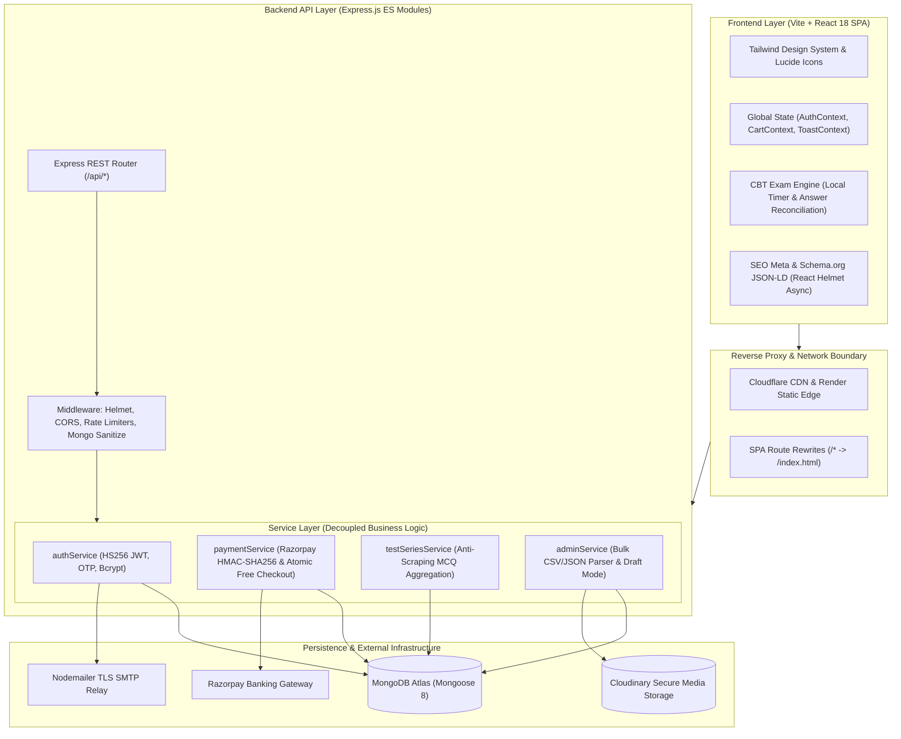

# PharmaCode07 — Pharmacy CBT & Competitive Examination Platform

> **Live Production URL:** [https://pharmacode07-9wva.onrender.com](https://pharmacode07-9wva.onrender.com)  
> A high-throughput, full-stack Computer-Based Test (CBT) engine and academic preparation platform engineered specifically for national and state-level pharmacist recruitment examinations (RRB, ESIC, OSSSC, GSSSB, AIIMS CRE, CISF ASI, UPSSSC, and BFUHS).

[](https://nodejs.org/)
[](https://expressjs.com/)
[](https://react.dev/)
[](https://vitejs.dev/)
[](https://tailwindcss.com/)
[](https://www.mongodb.com/)
[](https://razorpay.com/)
[](https://cloudinary.com/)

---

## 🏛️ System Architecture

PharmaCode07 uses a **decoupled service-oriented architecture** designed for high availability, zero race-conditions during exam submissions, and secure digital paywall enforcement.



---

## 💡 Engineering Highlights (What Makes It Production-Grade)

### 1. High-Fidelity CBT Exam Simulation Engine
- **State Reconciliation:** Maintains color-coded question state matrices (*Answered*, *Not Answered*, *Marked for Review*, *Answered & Marked for Review*, *Not Visited*) with instant palette navigation.
- **Client-Side Fault Tolerance:** Countdown timer with automated background time synchronization prevents tab-freeze cheating; triggers automated atomic submission upon expiry.
- **Dynamic Scoring Pipeline:** Configurable negative marking (-0.25 standard penalty) with instant post-exam analytics, difficulty-indexed breakdown, and clinical explanations.

### 2. Concurrency-Safe Financial & Order Architecture
- **Atomic Operations (`findOneAndUpdate`):** Zero double-spend vulnerability; atomic inventory decrements and coupon usage counter checks prevent race conditions during peak flash sales.
- **Dual-Mode Checkout:** 
  - **Paid Tier:** Server-generated order credentials validated via cryptographic HMAC-SHA256 signature verification.
  - **Zero-Cost Tier:** Instant transactional bypass for 100% discount coupons and free diagnostic mock papers without calling external banking gateways.
- **Strict Idempotency:** Guard rails at both frontend and database layers prevent duplicate enrollments for already purchased test series.

### 3. Digital Asset Protection & Anti-Scraping Paywall
- **Question Bank Scramble:** Free practice endpoints use MongoDB aggregation pipelines (`$sample`) capped at 25 randomized questions to protect proprietary intellectual property from bulk scraping.
- **Protected Study Material Streaming:** Direct file access is blocked; study material PDFs require authenticated subscription claims with signed stream delivery.
- **ReDoS Mitigation:** Regex-escaping sanitizers on user search queries protect Node.js event loops from regular expression denial-of-service vectors.

### 4. Search Engine Optimization & Knowledge Graph Ingestion
- **Schema.org Structured Data:** Validated `WebSite` and `EducationalOrganization` JSON-LD payloads embedded directly in the DOM, enabling native Google Site Name attribution and rich Google AI Mode synthesis.
- **Multi-Resolution Visual Assets:** 48px, 96px, and 192px Google-compliant square favicons for high-DPI search snippets, mobile PWA app icons, and browser tabs.
- **Dynamic Head Management:** `react-helmet-async` manages canonical URLs, Open Graph images, and Twitter Cards per route.

---

## 🎯 Platform Domain Modules

PharmaCode07 delivers four distinct preparation pillars:

| Pillar | Focus | Features |
| :--- | :--- | :--- |
| **Full CBT Test Series** | Central & State Pharmacist Recruitment | Structured 3-tier sub-folders (*Model Papers*, *Previous Year Papers*, *Subject-wise Drills*) with real exam timers for **RRB 2027**, **ESIC**, **OSSSC 2026**, **GSSSB**, **AIIMS CRE**, **CISF ASI**, **UPSSSC**, and **BFUHS**. |
| **Single Model Papers** | Rapid Skill Benchmarking | Standalone, single-paper mock exams with instant performance scorecards. |
| **PCI Study Packs** | Academic Curriculum Mastery | Unit-wise curated revision packs covering PCI B.Pharm (Semesters 1–8) and D.Pharm (Years 1–2). |
| **Non-Pharma Hub** | Non-Technical Score Booster | Specialized modules for General Studies, Reasoning, Numerical Ability, and Monthly Current Affairs required by government recruitment boards. |

---

## 🛠️ Complete Technology Stack

### Frontend
- **Framework:** React 18.2 (Hooks, Custom Context Providers)
- **Tooling:** Vite 5.2 (Fast HMR, optimized chunk splitting)
- **Styling:** Tailwind CSS 3.4 (Fully responsive mobile-first UI, custom animations)
- **Routing:** React Router DOM 6.23 (Client-side routing, protected route guards)
- **SEO & Social:** React Helmet Async (Dynamic metadata injection, Open Graph, Twitter Cards)
- **Icons & Effects:** Lucide React, Canvas-Confetti (Interactive celebratory feedback)
- **HTTP Client:** Axios (Centralized request/response interceptors, 401 token handling)

### Backend
- **Runtime:** Node.js 18+ (Native ES Modules syntax)
- **Framework:** Express.js 4.19 (RESTful API architecture)
- **Database Driver:** Mongoose 8.3 (Strict schema validation, aggregation pipelines)
- **Authentication:** JSON Web Tokens (JWT pinned to `HS256`), Bcrypt.js password hashing, Time-based OTP verification
- **Payment Processing:** Razorpay Official Node SDK (Webhook verification, HMAC signatures)
- **File Uploads & Storage:** Multer, Cloudinary SDK v2
- **Email Delivery:** Nodemailer (Authenticated SMTP with TLS)
- **Compression & Telemetry:** Compression (Gzip responses), Morgan logger

### Security & Hardening
- **HTTP Headers:** Helmet (Content Security Policy, frameguard, XSS protection)
- **Rate Limiting:** `express-rate-limit` (Window-based throttling on auth and test submission routes)
- **NoSQL Injection Defense:** `express-mongo-sanitize` (Sanitizes query payloads against `$where` and operator injections)
- **CORS Policy:** Strict origin whitelisting bound to production client environment variables

---

## 📂 Repository Layout

```
PharmaCode07/
├── backend/
│   ├── config/             # MongoDB connection pool & Cloudinary integration
│   ├── controllers/        # Express route handlers & payload controllers
│   ├── middleware/         # JWT verification, Admin RBAC, Rate limiters, Multer
│   ├── models/             # Mongoose schemas (User, TestSeries, TestPaper, Order, Coupon, etc.)
│   ├── routes/             # RESTful route definitions
│   ├── services/           # Decoupled business logic (Payment, Exam, Auth, Admin)
│   ├── utils/              # Email templates, regex sanitizers, signature verifiers
│   ├── server.js           # Express app bootstrap & middleware pipeline
│   └── package.json
│
├── frontend/
│   ├── public/             # Google 48px favicons, robots.txt, sitemap.xml
│   ├── src/
│   │   ├── components/
│   │   │   ├── admin/      # Admin dashboard management panels
│   │   │   ├── auth/       # OTP verification modals & login guards
│   │   │   ├── common/     # 10+ Standardized UI primitives (Cards, Badges, SearchInput)
│   │   │   ├── layout/     # Navbar, Responsive Footer, MobileBottomNav
│   │   │   └── test/       # CBT Examination Simulator, QuizTimer, QuestionPalette
│   │   ├── constants/      # Exam categories, PCI syllabus definitions
│   │   ├── context/        # AuthContext, CartContext, ToastContext
│   │   ├── pages/          # Application views & marketplace screens
│   │   ├── services/       # Centralized Axios API client with interceptors
│   │   ├── App.jsx         # Client-side router table & access boundaries
│   │   └── main.jsx        # Root application entry
│   ├── index.html          # HTML5 entry with Schema.org JSON-LD structured data
│   ├── tailwind.config.js  # Custom theme palette & layout rules
│   ├── vite.config.js      # Dev server proxy & production build pipeline
│   └── package.json
│
├── render.yaml             # Render infrastructure-as-code blueprint
└── README.md
```

---

## 📡 Key REST API Endpoints

| Category | Method | Path | Access | Purpose |
| :--- | :--- | :--- | :--- | :--- |
| **Authentication** | `POST` | `/api/auth/register` | Public | Register new candidate with profile |
| | `POST` | `/api/auth/login` | Public | Authenticate candidate / admin, issue JWT |
| | `GET` | `/api/auth/me` | Protected | Fetch current session & active enrollments |
| | `POST` | `/api/auth/verify-email` | Public | Validate OTP registration code |
| **Exam Engine** | `GET` | `/api/test-series` | Public | Query published test series packages |
| | `GET` | `/api/test-series/paper/:id` | Enrolled | Fetch full CBT question paper for attempt |
| | `POST` | `/api/attempts/submit` | Protected | Submit CBT exam response & calculate score |
| | `GET` | `/api/test-series/practice-mcqs`| Public | Capped random practice questions (anti-scraping) |
| **Orders & Payments**| `POST` | `/api/payments/create-order` | Protected | Initialize verified Razorpay checkout order |
| | `POST` | `/api/payments/verify` | Protected | Verify HMAC-SHA256 signature & grant access |
| | `POST` | `/api/payments/free-checkout`| Protected | Zero-cost atomic order fulfillment |
| | `POST` | `/api/coupons/apply` | Protected | Atomic coupon redemption validation |
| **Admin Cockpit** | `GET` | `/api/admin/test-series` | Admin | Query test series including draft states |
| | `POST` | `/api/admin/test-papers` | Admin | Create test paper with question sub-schemas |
| | `GET` | `/api/admin/stats` | Admin | Real-time platform revenue & candidate metrics |

---

## ⚙️ Local Development Setup

### Prerequisites
- Node.js (v18.0.0 or higher)
- MongoDB Atlas cluster or local MongoDB instance
- Active Razorpay Test Mode keys (for checkout simulation)

### 1. Clone & Install
```bash
git clone https://github.com/pharmacode07/pharmacode07-platform.git
cd pharmacode07-platform
```

### 2. Backend Configuration
```bash
cd backend
npm install
cp .env.example .env
```

Configure `backend/.env`:
```env
PORT=5000
NODE_ENV=development
CLIENT_URL=http://localhost:5173
MONGO_URI=your_mongodb_connection_string
JWT_SECRET=your_jwt_signing_secret
JWT_EXPIRE=30d
RAZORPAY_KEY_ID=rzp_test_YourKey
RAZORPAY_KEY_SECRET=YourSecret
EMAIL_SERVICE=gmail
EMAIL_USER=your_email@gmail.com
EMAIL_PASS=your_app_password
EMAIL_FROM=PharmaCode07 <your_email@gmail.com>
```

Start backend development server:
```bash
npm run dev
# Running at http://localhost:5000
```

### 3. Frontend Configuration
```bash
cd ../frontend
npm install
npm run dev
# Running at http://localhost:5173
```
*Note: Vite dev server automatically proxies `/api` network requests to `http://localhost:5000` via `vite.config.js`.*

---

## 🚀 Production Deployment Architecture

The platform is hosted on **Render** utilizing automated continuous deployment:

- **Frontend:** Render Static Site with Cloudflare edge caching, HTTP/2, automated SSL, and client rewrite rule (`/* -> /index.html`).
- **Backend:** Render Node.js Web Service operating in production mode behind a reverse proxy with automated health checks.
- **Database:** MongoDB Atlas M0/M10 replica set with TLS encryption at rest and in transit.

---

## 📄 License & Attribution

Developed with high engineering standards for competitive pharmacy exam candidates across India.  
**PharmaCode07 © 2026. All rights reserved.**
